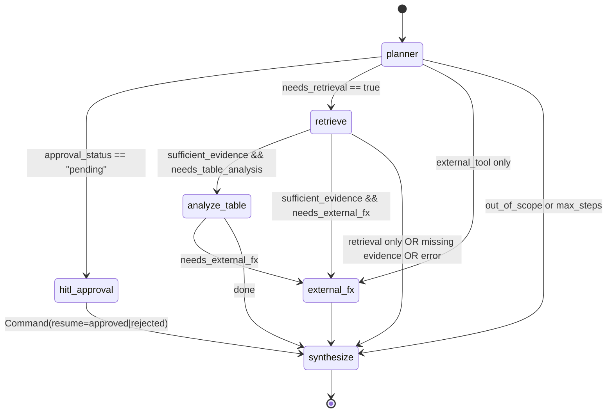

# Project 2 Architecture: Agent Orchestration Layer

## LangGraph State Machine

```mermaid
stateDiagram-v2
    [*] --> planner
    planner --> hitl_approval: approval_status == "pending"
    planner --> retrieve: needs_retrieval == true
    planner --> external_fx: external_tool only
    planner --> synthesize: out_of_scope or max_steps

    retrieve --> analyze_table: sufficient_evidence && needs_table_analysis
    retrieve --> external_fx: sufficient_evidence && needs_external_fx
    retrieve --> synthesize: retrieval only OR missing evidence OR error

    analyze_table --> external_fx: needs_external_fx
    analyze_table --> synthesize: done

    external_fx --> synthesize
    hitl_approval --> synthesize: Command(resume=approved|rejected)
    synthesize --> [*]
```
